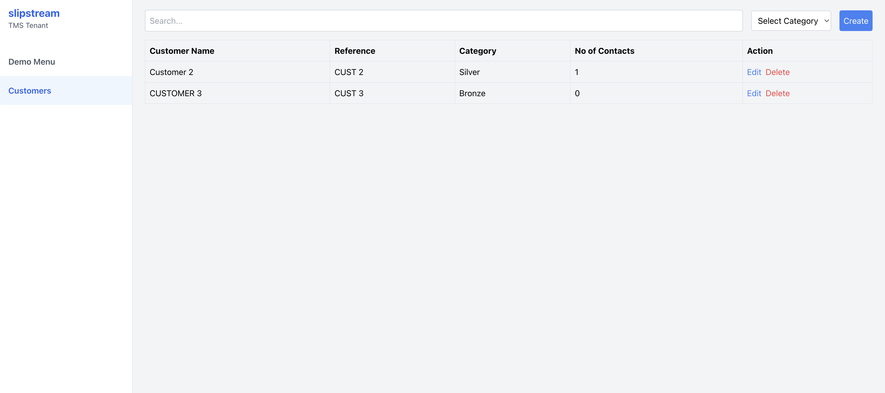
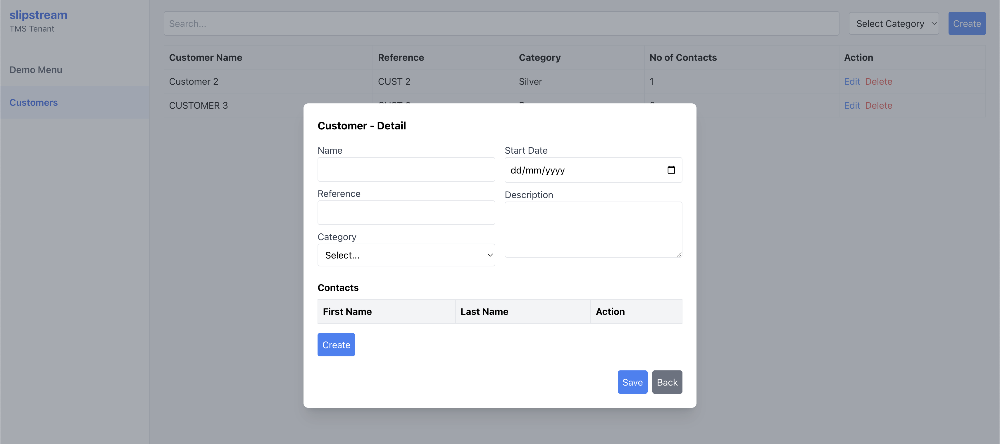

# 🚀 Slipstream Customer Management Demo

## 📘 Project Overview

This repository contains a developer assessment task for **Slipstream**, showcasing the ability to translate a project brief into a fully functional customer management application using **Laravel 11** and **Vue.js 3**.

The system allows for managing customers and their contacts with CRUD functionality, live updates, and validation. It demonstrates clean architecture, reusable components, and comprehensive testing.

---

## ✅ Key Features

- 🧾 Summary table listing all customers
  - 🔍 Plain text search
  - 🗂️ Filter by customer category (Gold, Silver, Bronze)
- ➕ Create / ✏️ Edit / ❌ Delete operations for customers
  - Modals with **frontend and backend validation**
  - Category selection
- 👥 Contact management per customer
  - Add/edit/delete contacts within the customer modal
  - Immediate updates on contact actions
- 🔐 Confirmation prompts on delete actions
- ✅ Unit and Feature tests for:
  - Models and relationships
  - Controllers (CRUD and validation)
- 💡 Clean architecture and commit history
  - Reusable components
  - Meaningful comments
  - Modular structure

---

## 🌐 Live Demo

You can access the live deployed demo at:  
**🔗 https://slipstream-demo.khaled-shaheen.online/customers**

> Note: This is a demo deployment. Performance may vary due to hosting limits.

---

## 🧰 Tech Stack

| Layer     | Tech                                 |
|-----------|--------------------------------------|
| Backend   | Laravel 11 (PHP 8.2+)                |
| Frontend  | Vue.js 3                             |
| Styling   | Custom CSS (extendable via Tailwind) |
| Database  | MySQL (or MariaDB)                   |
| Testing   | PHPUnit with Factories & `RefreshDatabase` |
| Tooling   | Vite (asset compilation), Composer, npm |

---

## 📸 Screenshots

>   
>   
> 

---

## ⚙️ Prerequisites

- PHP 8.2+
- Composer
- Node.js and npm
- MySQL or MariaDB
- Git

---

## 🧪 Installation & Setup

```bash
# 1. Clone the repository
git clone https://github.com/<your-username>/slipstream-demo.git
cd slipstream-demo

# 2. Install PHP dependencies
composer install

# 3. Install frontend dependencies
npm install

# 4. Copy and configure the .env file
cp .env.example .env
# Edit DB credentials:
# DB_DATABASE=slipstream_db
# DB_USERNAME=root
# DB_PASSWORD=

# 5. Generate app key
php artisan key:generate

# 6. Run migrations and seeders
php artisan migrate --seed
```

---

## ▶️ Running the Application

```bash
# Compile assets
npm run dev         # Development mode (with hot reload)
npm run build       # Production build

# Start Laravel backend
php artisan serve
```

Open your browser and visit:  
**http://localhost:8000/customers**

---

## 🧪 Running Tests

```bash
# Run all unit and feature tests
php artisan test

# Generate a coverage report
php artisan test --coverage
```

### ✅ Expected Output (Sample)

```
PASS  Tests\Feature\CustomerCrudTest
✓ can create customer

PASS  Tests\Feature\ContactControllerTest
✓ it can create a contact
✓ it validates create request
✓ it can update a contact
✓ it can delete a contact

PASS  All tests passed (18 assertions)
```

---

## 📁 Folder Structure (Simplified)

```
├── app/
│   └── Models, Http, Providers...
├── resources/
│   └── js/
│       ├── components/
│       └── views/
├── routes/
│   └── web.php
├── tests/
│   └── Feature/, Unit/
├── database/
│   └── migrations/, seeders/, factories/
```

---

## 🧑‍💻 Developer Notes

- This is a demo project built for a technical assessment.
- Code is modular, maintainable, and follows Laravel/Vue best practices.
- Commit history shows progression of features and testing coverage.

---

## 📄 License / Disclaimer

This project was developed as part of a **developer assessment task** and is **not intended for production** use.  
All content is for demonstration purposes only.

---

## 👋 Contact

Developed by **Khaled Shaheen**  
🔗 [LinkedIn](https://www.linkedin.com/in/khaled-loay-shaheen)  
📧 khaledloay@hotmail.com
